# JOSE 🌌

  

  

## 🔬 About Me

I am a **Physics undergraduate at [Universidad de Antioquia](https://www.udea.edu.co/wps/portal/udea/web/inicio)**, focused on theoretical and computational physics.

My primary research interests center on **General Relativity and Quantum Gravity**, specifically:

- **Hamiltonian Formulation of Gravity**: Metric and tetrad/Palatini formulations using the Dirac formalism for constrained systems.
- **Gauge Symmetries & Degrees of Freedom**: Understanding how gauge invariants and physical constraints propagate across covariant field theories.
- **Symbolic & Numerical Tensor Calculus**: Developing computational tools to automate differential geometry, curvature computations, and perturbation theories.

---

## 🔬 Research Areas & Core Toolkit

### 🌌 Theoretical & Mathematical Physics

- **General Relativity:** ADM formalism, Palatini formulation, canonical gravity, constrained systems.
- **Quantum Gravity:** Hamiltonian formulations, gauge symmetries, constraint algebras, physical degrees of freedom.
- **Quantum Mechanics:** Rayleigh–Schrödinger and Brillouin–Wigner perturbation theory.
- **Field Theory & Nonlinear PDEs:** Sine-Gordon equations, soliton dynamics, PINNs.

### 💻 Computational Physics & Symbolic Computing

- **Symbolic Computing:** `Mathematica`, `xAct`, `Cadabra2`, `SageMath`
- **Scientific Computing:** `Python` (NumPy, SciPy, PyTorch), `C++`, `CUDA`
- **Scientific Tools:** `Git`, `Linux`, `LaTeX`

---

## 📚 Selected Research Projects

- **[Hamiltonian Formulations of General Relativity](https://github.com/dassjoss/Hamiltonian-Formulations-of-General-Relativity)**  
  Comparative analysis of constraint structures, gauge algebras, and physical degrees of freedom in metric and tetrad formulations.

- **[TensorToolkit](https://github.com/dassjoss/ToolkitMathematica)**  
  Modular Wolfram Language package for symbolic tensor algebra, curvature tensors, and differential forms.

- **[Covariant Derivative Expansion Framework — Cadabra2](https://github.com/dassjoss/Cadabra_Modules)**  
  Python-based framework for index manipulation and covariant expansions in spacetime geometry.

- **[Perturbative Quantum Mechanics](https://github.com/dassjoss/Analysis_on_Perturbative_Methods_in_Quantum_Mechanics)**  
  Analysis of convergence and truncation behavior in Rayleigh–Schrödinger and Dalgarno–Lewis perturbative expansions.

---

## 🐍 Contributions

  <picture>
    <source media="(prefers-color-scheme: dark)" srcset="https://raw.githubusercontent.com/dassjoss/dassjoss/output/github-contribution-grid-snake-dark.svg">
    <source media="(prefers-color-scheme: light)" srcset="https://raw.githubusercontent.com/dassjoss/dassjoss/output/github-contribution-grid-snake.svg">
    
  </picture>

---

  <a href="mailto:jose.ortizc@udea.edu.co"><code>Email</code></a> · 
  <a href="https://github.com/dassjoss"><code>GitHub</code></a>

