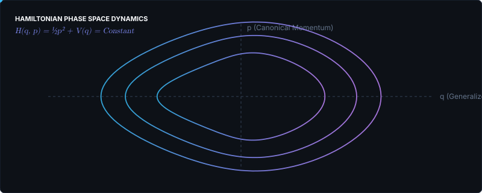

# JOSE 🌌

  <b>Physics × Computation</b> 
  <i>General Relativity · Quantum Gravity · Constrained Dynamics · Symbolic Computing</i>

  

## 🔬 About Me

I am a **Physics undergraduate at Universidad de Antioquia**, focused on theoretical and computational physics.

My primary research interests center on **General Relativity and Quantum Gravity**, specifically:
- **Hamiltonian Formulation of Gravity**: Metric and tetrad/Palatini formulations using the Dirac formalism for constrained systems ($H = N H_0 + N^i H_i \approx 0$).
- **Gauge Symmetries & Degrees of Freedom**: Understanding how gauge invariants and physical constraints propagate across covariant field theories.
- **Symbolic & Numerical Tensor Calculus**: Developing computational tools to automate differential geometry, curvature computations, and perturbation theories.

---

  

---

## 🛠️ Research Areas & Core Toolkit

<table>
  <tr>
    <td width="50%" valign="top">
      <h3>🌌 Theoretical & Mathematical Physics</h3>
      <ul>
        <li><b>General Relativity:</b> ADM formalism, Palatini action, canonical gravity.</li>
        <li><b>Quantum Mechanics:</b> Rayleigh–Schrödinger & Brillouin–Wigner perturbation theory.</li>
        <li><b>Field Theory & Nonlinear PDE:</b> Sine-Gordon, Soliton dynamics, PINNs.</li>
      </ul>
    </td>
    <td width="50%" valign="top">
      <h3>💻 Computational Physics & Symbolic Computing</h3>
      <ul>
        <li><b>Symbolic Engines:</b> <code>Mathematica</code>, <code>xAct</code>, <code>Cadabra2</code>, <code>SageMath</code></li>
        <li><b>Scientific Computing:</b> <code>Python</code> (NumPy, SciPy, PyTorch), <code>C++</code>, <code>CUDA</code></li>
        <li><b>Analysis & Systems:</b> <code>Git</code>, <code>Linux</code>, <code>LaTeX</code></li>
      </ul>
    </td>
  </tr>
</table>

---

## 📚 Selected Research Projects

- **Hamiltonian Formulations of General Relativity**  
  *Comparative analysis of constraint structures, gauge algebra, and physical degrees of freedom in metric vs tetrad variables.*
- **TensorToolkit**  
  *Modular Wolfram Language package for symbolic tensor algebra, curvature tensors, and differential forms.*
- **Covariant Derivative Expansion Framework (Cadabra2)**  
  *Python-based framework for index manipulation and covariant expansions in spacetime geometry.*
- **Perturbative Quantum Mechanics**  
  *Convergence analysis and truncation behaviors of Rayleigh–Schrödinger and Dalgarno–Lewis expansions.*

---

  <a href="mailto:jose.ortizc@udea.edu.co"><code>Email</code></a> · 
  <a href="https://github.com/dassjoss"><code>GitHub</code></a>

